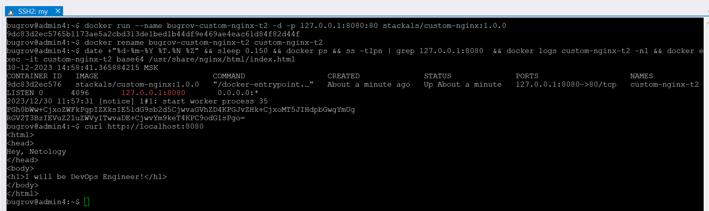
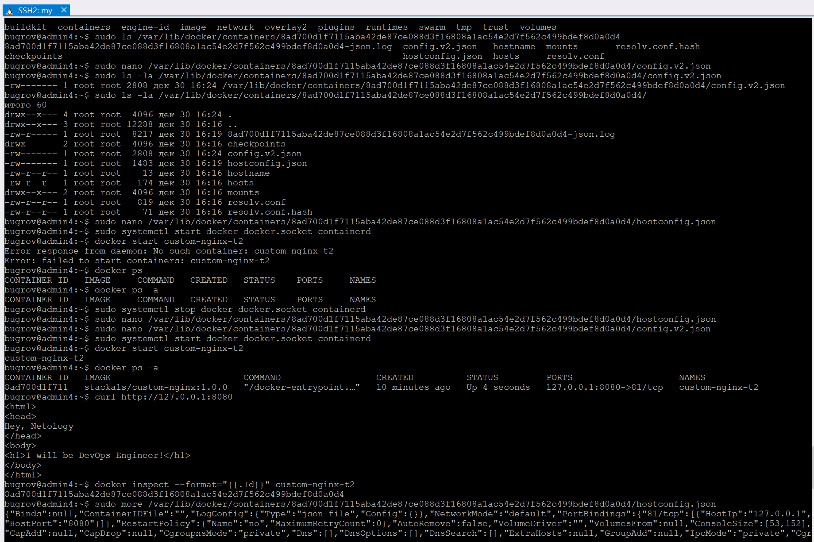
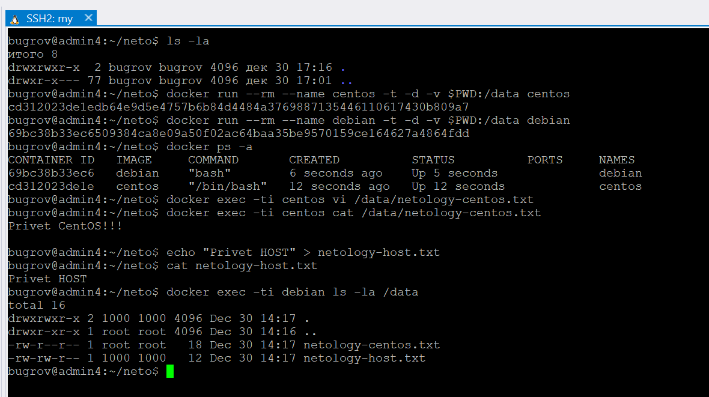
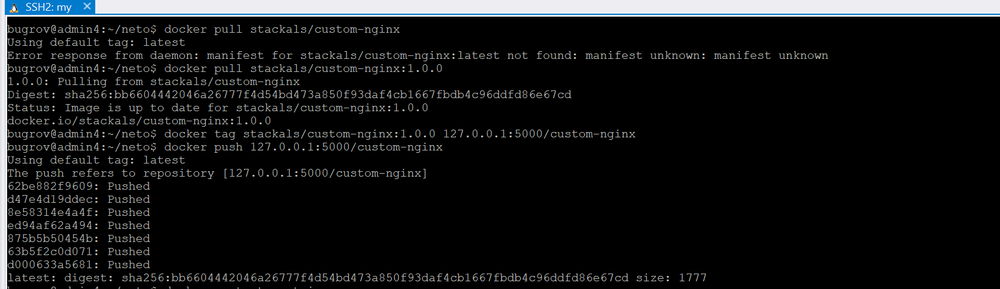
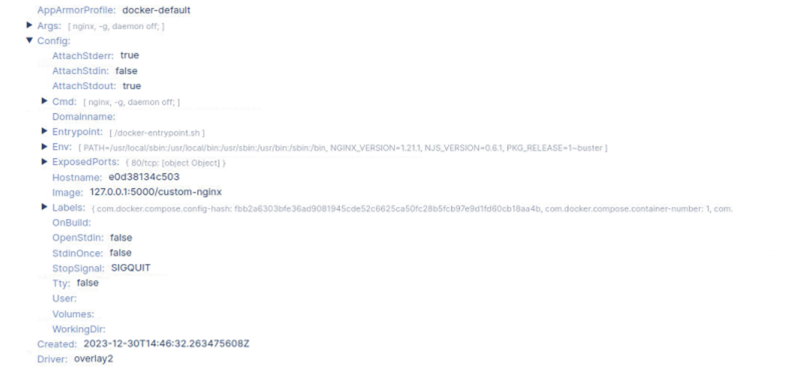
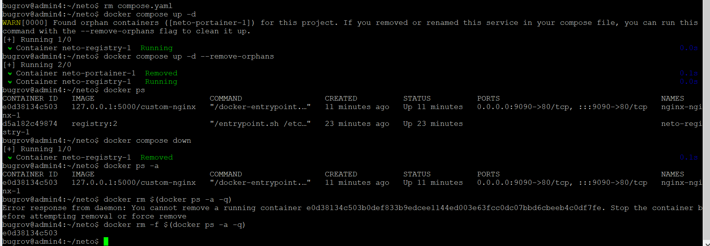

# Домашняя работа к занятию 4 «Оркестрация группой Docker контейнеров на примере Docker Compose»

## Задача 1

```bash
docker pull nginx:1.21.1
docker build -t stackals/custom-nginx:1.0.0 .
docker push stackals/custom-nginx:1.0.0
```

https://hub.docker.com/repository/docker/stackals/custom-nginx/general

## Задача 2

```bash
bugrov@admin4:~$ docker run --name bugrov-custom-nginx-t2 -d -p 127.0.0.1:8080:80 stackals/custom-nginx:1.0.0
9dc83d2ec5765b1173ae5a2cbd313de1bed1b44df9e469ae4eac61d84f82d44f
bugrov@admin4:~$ docker rename bugrov-custom-nginx-t2 custom-nginx-t2
bugrov@admin4:~$ date +"%d-%m-%Y %T.%N %Z" && sleep 0.150 && docker ps && ss -tlpn | grep 127.0.0.1:8080  && docker logs custom-nginx-t2 -n1 && docker exec -it custom-nginx-t2 base64 /usr/share/nginx/html/index.html
30-12-2023 14:58:41.365884215 MSK
CONTAINER ID   IMAGE                         COMMAND                  CREATED              STATUS              PORTS                    NAMES
9dc83d2ec576   stackals/custom-nginx:1.0.0   "/docker-entrypoint.…"   About a minute ago   Up About a minute   127.0.0.1:8080->80/tcp   custom-nginx-t2
LISTEN 0      4096       127.0.0.1:8080       0.0.0.0:*
2023/12/30 11:57:31 [notice] 1#1: start worker process 35
PGh0bWw+CjxoZWFkPgpIZXksIE5ldG9sb2d5CjwvaGVhZD4KPGJvZHk+CjxoMT5JIHdpbGwgYmUg
RGV2T3BzIEVuZ2luZWVyITwvaDE+CjwvYm9keT4KPC9odG1sPgo=
bugrov@admin4:~$ curl http://localhost:8080
<html>
<head>
Hey, Netology
</head>
<body>
<h1>I will be DevOps Engineer!</h1>
</body>
</html>
bugrov@admin4:~$
```



## Задача 3

```bash
# Подключение консоли ввода вывода к запущенному контейнеру
docker attach custom-nginx-t2
# При выполнении Ctrl-C в системе Ubuntu 23.10 консоль просто висит и ничего не происходит
# При выполнении Ctrl-C в системе Ubuntu 20.04 (Windows wsl) произошла ожидаемая остановка контейнера 
docker ps -a
# Контейнер остановился, потому что консоль подключается к процессу с pid 1 внутри контейнера и нажатием Ctrl-C мы этому процессу передаем сигнал SIGINT и процесс завершается - соответственно завершается и контейнер. 
docker exec -ti custom-nginx-t2 bash
root@54b7132ea49b:/# apt update
root@54b7132ea49b:/# apt install nano
root@54b7132ea49b:/# nano /etc/nginx/conf.d/default.conf
root@54b7132ea49b:/# nginx -s reload
2023/12/30 12:44:44 [notice] 326#326: signal process started
root@54b7132ea49b:/# curl http://127.0.0.1:80
curl: (7) Failed to connect to 127.0.0.1 port 80: Connection refused
root@54b7132ea49b:/# curl http://127.0.0.1:81
<html>
<head>
Hey, Netology
</head>
<body>
<h1>I will be DevOps Engineer!</h1>
</body>
</html>
root@54b7132ea49b:/# exit

bugrov@admin4:~$ docker ps
CONTAINER ID   IMAGE                         COMMAND                  CREATED         STATUS         PORTS                    NAMES
54b7132ea49b   stackals/custom-nginx:1.0.0   "/docker-entrypoint.…"   6 minutes ago   Up 6 minutes   127.0.0.1:8080->80/tcp   custom-nginx-t2
bugrov@admin4:~$ ss -tlpn | grep 127.0.0.1:8080
LISTEN 0      4096       127.0.0.1:8080       0.0.0.0:*
bugrov@admin4:~$  docker port custom-nginx-t2
80/tcp -> 127.0.0.1:8080
bugrov@admin4:~$ curl http://127.0.0.1:8080
curl: (56) Recv failure: Соединение разорвано другой стороной
# Внутри контейнера нет больше сервиса принимающего запросы на порту 80 - потому ничего и не работает

# 11.
docker stop custom-nginx-t2
sudo systemctl stop docker docker.socket containerd
docker inspect --format="{{.Id}}" custom-nginx-t2
8ad700d1f7115aba42de87ce088d3f16808a1ac54e2d7f562c499bdef8d0a0d4

sudo nano /var/lib/docker/containers/8ad700d1f7115aba42de87ce088d3f16808a1ac54e2d7f562c499bdef8d0a0d4/hostconfig.json
sudo cat /var/lib/docker/containers/8ad700d1f7115aba42de87ce088d3f16808a1ac54e2d7f562c499bdef8d0a0d4/hostconfig.json
{"Binds":null,"ContainerIDFile":"","LogConfig":{"Type":"json-file","Config":{}},"NetworkMode":"default","PortBindings":{"81/tcp":[{"HostIp":"127.0.0.1","HostPort":"8080"}]},"RestartPolicy":{"Name":"no","MaximumRetryCount":0},"AutoRemove":false,"VolumeDriver":"","VolumesFrom":null,"ConsoleSize":[53,152],"CapAdd":null,"CapDrop":null,"CgroupnsMode":"private","Dns":[],"DnsOptions":[],"DnsSearch":[],"ExtraHosts":null,"GroupAdd":null,"IpcMode":"private","Cgroup":"","Links":null,"OomScoreAdj":0,"PidMode":"","Privileged":false,"PublishAllPorts":false,"ReadonlyRootfs":false,"SecurityOpt":null,"UTSMode":"","UsernsMode":"","ShmSize":67108864,"Runtime":"runc","Isolation":"","CpuShares":0,"Memory":0,"NanoCpus":0,"CgroupParent":"","BlkioWeight":0,"BlkioWeightDevice":[],"BlkioDeviceReadBps":[],"BlkioDeviceWriteBps":[],"BlkioDeviceReadIOps":[],"BlkioDeviceWriteIOps":[],"CpuPeriod":0,"CpuQuota":0,"CpuRealtimePeriod":0,"CpuRealtimeRuntime":0,"CpusetCpus":"","CpusetMems":"","Devices":[],"DeviceCgroupRules":null,"DeviceRequests":null,"MemoryReservation":0,"MemorySwap":0,"MemorySwappiness":null,"OomKillDisable":null,"PidsLimit":null,"Ulimits":null,"CpuCount":0,"CpuPercent":0,"IOMaximumIOps":0,"IOMaximumBandwidth":0,"MaskedPaths":["/proc/asound","/proc/acpi","/proc/kcore","/proc/keys","/proc/latency_stats","/proc/timer_list","/proc/timer_stats","/proc/sched_debug","/proc/scsi","/sys/firmware"],"ReadonlyPaths":["/proc/bus","/proc/fs","/proc/irq","/proc/sys","/proc/sysrq-trigger"]}

sudo nano /var/lib/docker/containers/8ad700d1f7115aba42de87ce088d3f16808a1ac54e2d7f562c499bdef8d0a0d4/config.v2.json
sudo cat /var/lib/docker/containers/8ad700d1f7115aba42de87ce088d3f16808a1ac54e2d7f562c499bdef8d0a0d4/config.v2.json
{"StreamConfig":{},"State":{"Running":true,"Paused":false,"Restarting":false,"OOMKilled":false,"RemovalInProgress":false,"Dead":false,"Pid":1374767,"ExitCode":0,"Error":"","StartedAt":"2023-12-30T13:27:28.918018959Z","FinishedAt":"2023-12-30T13:19:36.838329774Z","Health":null},"ID":"8ad700d1f7115aba42de87ce088d3f16808a1ac54e2d7f562c499bdef8d0a0d4","Created":"2023-12-30T13:16:55.186239134Z","Managed":false,"Path":"/docker-entrypoint.sh","Args":["nginx","-g","daemon off;"],"Config":{"Hostname":"8ad700d1f711","Domainname":"","User":"","AttachStdin":false,"AttachStdout":false,"AttachStderr":false,"ExposedPorts":{"81/tcp":{}},"Tty":false,"OpenStdin":false,"StdinOnce":false,"Env":["PATH=/usr/local/sbin:/usr/local/bin:/usr/sbin:/usr/bin:/sbin:/bin","NGINX_VERSION=1.21.1","NJS_VERSION=0.6.1","PKG_RELEASE=1~buster"],"Cmd":["nginx","-g","daemon off;"],"Image":"stackals/custom-nginx:1.0.0","Volumes":null,"WorkingDir":"","Entrypoint":["/docker-entrypoint.sh"],"OnBuild":null,"Labels":{"maintainer":"NGINX Docker Maintainers \u003cdocker-maint@nginx.com\u003e"},"StopSignal":"SIGQUIT"},"Image":"sha256:35d727c3455bcc06a640244c2d2d0975f5712d32bd73b89b461a54202de998a2","ImageManifest":null,"NetworkSettings":{"Bridge":"","SandboxID":"9c0503d15f7f5d71cfd58d12f21857271199c9f0e9672c74b8d66dc0e975f28f","HairpinMode":false,"LinkLocalIPv6Address":"","LinkLocalIPv6PrefixLen":0,"Networks":{"bridge":{"IPAMConfig":null,"Links":null,"Aliases":null,"NetworkID":"91a58292f9d490286e611fdfc21e50a410554c496f1f9a36573365668c894e85","EndpointID":"919a94244e0471f130c7549f05b61d3079505ad0c78bf480553bf617e93b4359","Gateway":"172.20.0.1","IPAddress":"172.20.0.2","IPPrefixLen":24,"IPv6Gateway":"","GlobalIPv6Address":"","GlobalIPv6PrefixLen":0,"MacAddress":"02:42:ac:14:00:02","DriverOpts":null,"IPAMOperational":false}},"Service":null,"Ports":{"81/tcp":[{"HostIp":"127.0.0.1","HostPort":"8080"}]},"SandboxKey":"/var/run/docker/netns/9c0503d15f7f","SecondaryIPAddresses":null,"SecondaryIPv6Addresses":null,"IsAnonymousEndpoint":false,"HasSwarmEndpoint":false},"LogPath":"/var/lib/docker/containers/8ad700d1f7115aba42de87ce088d3f16808a1ac54e2d7f562c499bdef8d0a0d4/8ad700d1f7115aba42de87ce088d3f16808a1ac54e2d7f562c499bdef8d0a0d4-json.log","Name":"/custom-nginx-t2","Driver":"overlay2","OS":"linux","RestartCount":0,"HasBeenStartedBefore":true,"HasBeenManuallyStopped":false,"MountPoints":{},"SecretReferences":null,"ConfigReferences":null,"MountLabel":"","ProcessLabel":"","AppArmorProfile":"docker-default","SeccompProfile":"","NoNewPrivileges":false,"HostnamePath":"/var/lib/docker/containers/8ad700d1f7115aba42de87ce088d3f16808a1ac54e2d7f562c499bdef8d0a0d4/hostname","HostsPath":"/var/lib/docker/containers/8ad700d1f7115aba42de87ce088d3f16808a1ac54e2d7f562c499bdef8d0a0d4/hosts","ShmPath":"","ResolvConfPath":"/var/lib/docker/containers/8ad700d1f7115aba42de87ce088d3f16808a1ac54e2d7f562c499bdef8d0a0d4/resolv.conf","LocalLogCacheMeta":{"HaveNotifyEnabled":false}}

sudo systemctl start docker docker.socket containerd
docker start custom-nginx-t2

docker ps -a
CONTAINER ID   IMAGE                         COMMAND                  CREATED          STATUS         PORTS                    NAMES
8ad700d1f711   stackals/custom-nginx:1.0.0   "/docker-entrypoint.…"   18 minutes ago   Up 7 minutes   127.0.0.1:8080->81/tcp   custom-nginx-t2

curl http://127.0.0.1:8080
<html>
<head>
Hey, Netology
</head>
<body>
<h1>I will be DevOps Engineer!</h1>
</body>
</html>

 docker rm -f custom-nginx-t2

```



## Задача 4

```bash
bugrov@admin4:~/neto$ ls -la
итого 8
drwxrwxr-x  2 bugrov bugrov 4096 дек 30 17:16 .
drwxr-x--- 77 bugrov bugrov 4096 дек 30 17:01 ..
bugrov@admin4:~/neto$ docker run --rm --name centos -t -d -v $PWD:/data centos
cd312023de1edb64e9d5e4757b6b84d4484a3769887135446110617430b809a7
bugrov@admin4:~/neto$ docker run --rm --name debian -t -d -v $PWD:/data debian
69bc38b33ec6509384ca8e09a50f02ac64baa35be9570159ce164627a4864fdd
bugrov@admin4:~/neto$ docker ps -a
CONTAINER ID   IMAGE     COMMAND       CREATED          STATUS          PORTS     NAMES
69bc38b33ec6   debian    "bash"        6 seconds ago    Up 5 seconds              debian
cd312023de1e   centos    "/bin/bash"   12 seconds ago   Up 12 seconds             centos
bugrov@admin4:~/neto$ docker exec -ti centos vi /data/netology-centos.txt
bugrov@admin4:~/neto$ docker exec -ti centos cat /data/netology-centos.txt
Privet CentOS!!!

bugrov@admin4:~/neto$ echo "Privet HOST" > netology-host.txt
bugrov@admin4:~/neto$ cat netology-host.txt
Privet HOST
bugrov@admin4:~/neto$ docker exec -ti debian ls -la /data
total 16
drwxrwxr-x 2 1000 1000 4096 Dec 30 14:17 .
drwxr-xr-x 1 root root 4096 Dec 30 14:16 ..
-rw-r--r-- 1 root root   18 Dec 30 14:17 netology-centos.txt
-rw-rw-r-- 1 1000 1000   12 Dec 30 14:17 netology-host.txt
bugrov@admin4:~/neto$ docker stop centos debian
```



## Задача 5

Команда "docker compose up -d" по умолчанию выполняет compose.yaml или docker-compose.yaml, но если они оба присутствуют, то выполняется первый.

Скорректированный файл [compose.yaml](./src/p5/compose.yaml)

```bash
docker pull stackals/custom-nginx:1.0.0
# устанавливаем тэг
docker tag stackals/custom-nginx:1.0.0 127.0.0.1:5000/custom-nginx
# заливаем в локальный registry
docker push 127.0.0.1:5000/custom-nginx

```






