# Домашняя работа к занятию 5. «Практическое применение Docker»

## Задача 1

[Dockerfile.python](./app/Dockerfile.python)

.env файл

```bash
DB_HOST=127.0.0.1
DB_USER=app
DB_PASSWORD=very_strong
DB_NAME=example
DB_TABLE=requests
```

Запуск web-приложения без использования docker (в venv.) (Mysql БД можно запустить в docker run).

```bash
export $(grep -v '^#' .env | xargs -d '\n')

docker run -p 3306:3306 -d --name mysql -e MYSQL_ROOT_PASSWORD=$DB_PASSWORD -e MYSQL_DATABASE=$DB_NAME -e MYSQL_USER=$DB_USER -e MYSQL_PASSWORD=$DB_PASSWORD -e TZ='Europe/Moscow' mysql

docker ps
CONTAINER ID   IMAGE     COMMAND                  CREATED          STATUS          PORTS                               NAMES
e65521b86af5   mysql     "docker-entrypoint.s…"   15 minutes ago   Up 15 minutes   0.0.0.0:3306->3306/tcp, 33060/tcp   mysql

python3 -m venv venv
venv/bin/python3 nl-shvirtd-example-python/main.py
```

Изменения в main.py для управления названием используемой таблицы через ENV переменную.

```python
#...
db_table=os.environ.get('DB_TABLE')
#...
# SQL-запрос для создания таблицы в БД
create_table_query = f"""
CREATE TABLE IF NOT EXISTS {db_database}.{db_table} (
id INT AUTO_INCREMENT PRIMARY KEY,
request_date DATETIME,
request_ip VARCHAR(255)
)
"""
#...
query = f"""INSERT INTO {db_table} (request_date, request_ip) VALUES (%s, %s)"""
#...
```

## Задача 2 (*)

```bash
yc container registry create --name test

done (1s)
id: crpe719t8lr4rpibo4r6
folder_id: b1g8b6f8d7c5bnb4bgan
name: test
status: ACTIVE
created_at: "2024-01-02T14:07:39.084Z"

yc container registry configure-docker

docker build -t cr.yandex/crpe719t8lr4rpibo4r6/pyapp:1.0.0 -f Dockerfile.python .
docker push cr.yandex/crpe719t8lr4rpibo4r6/pyapp:1.0.0

```

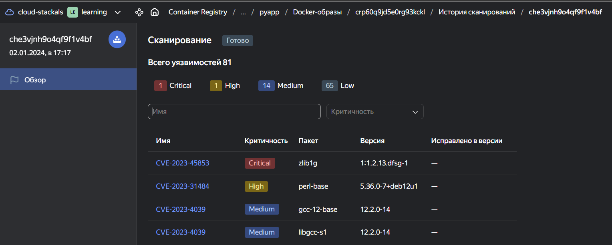

## Задача 3

[compose.yaml](./app/compose.yaml)

```bash
curl -L http://127.0.0.1:8080
TIME: 2024-01-03 21:37:12, IP: None
curl -L http://127.0.0.1:8090
TIME: 2024-01-03 21:37:03, IP: 127.0.0.1
```

```bash
docker exec -ti app-db-1 mysql -uroot -p
Enter password:
Welcome to the MySQL monitor.  Commands end with ; or \g.
Your MySQL connection id is 10
Server version: 8.2.0 MySQL Community Server - GPL

Copyright (c) 2000, 2023, Oracle and/or its affiliates.

Oracle is a registered trademark of Oracle Corporation and/or its
affiliates. Other names may be trademarks of their respective
owners.

Type 'help;' or '\h' for help. Type '\c' to clear the current input statement.

mysql> show databases;
+--------------------+
| Database           |
+--------------------+
| information_schema |
| mysql              |
| performance_schema |
| pyappdb            |
| sys                |
+--------------------+
5 rows in set (0.00 sec)

mysql> use pyappdb;
Reading table information for completion of table and column names
You can turn off this feature to get a quicker startup with -A

Database changed
mysql> show tables;
+-------------------+
| Tables_in_pyappdb |
+-------------------+
| requests          |
+-------------------+
1 row in set (0.01 sec)

mysql> SELECT * from requests LIMIT 10;
+----+---------------------+------------+
| id | request_date        | request_ip |
+----+---------------------+------------+
|  1 | 2024-01-03 21:34:11 | NULL       |
|  2 | 2024-01-03 21:34:19 | 127.0.0.1  |
|  3 | 2024-01-03 21:37:03 | 127.0.0.1  |
|  4 | 2024-01-03 21:37:12 | NULL       |
+----+---------------------+------------+
4 rows in set (0.00 sec)
```

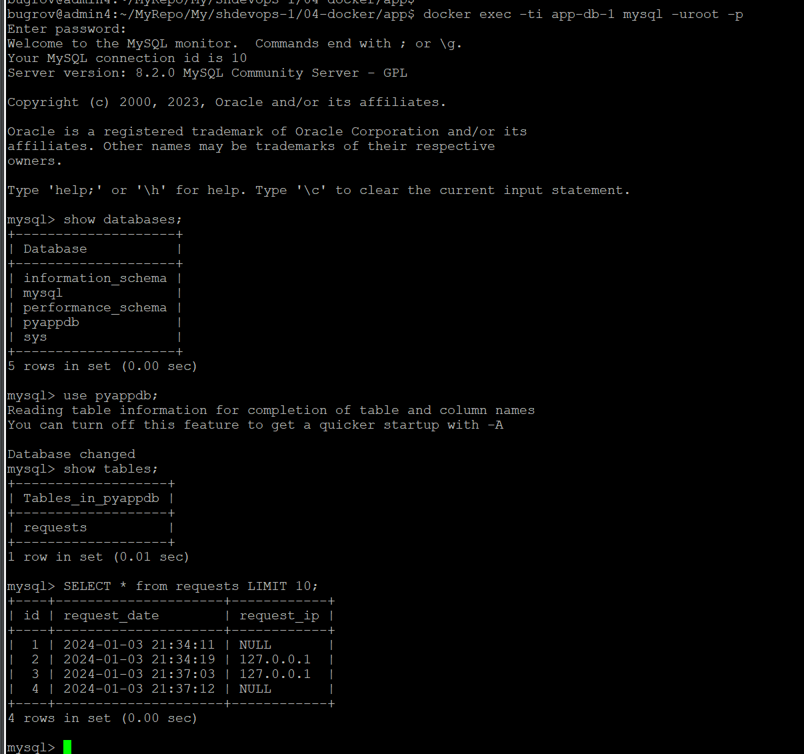

## Задача 4

[script CD](./app/deploy.sh)

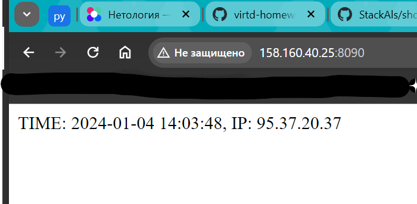
К сожалению - приложение выдает ошибку СУБД при массовых запросах.
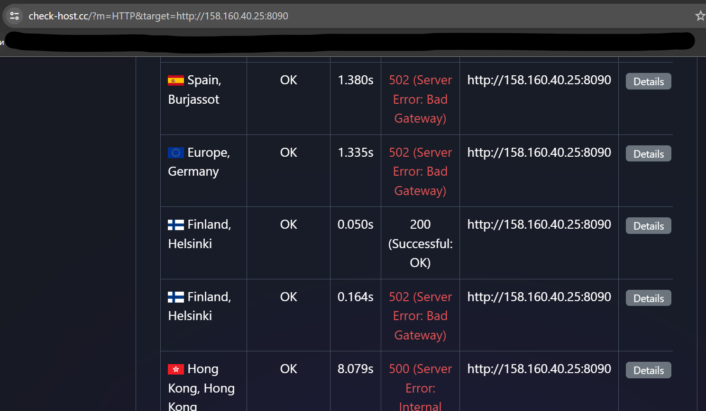

Настройка remote ssh context к серверу

```bash
# На удаленной системе (сервер)
sudo systemctl edit docker.service

[Service]
ExecStart=
ExecStart=/usr/bin/dockerd -H fd:// -H tcp://0.0.0.0:2375

sudo systemctl daemon-reload
sudo systemctl restart docker.service

sudo ss -tulpan | grep 2375
tcp   LISTEN     0      4096      *:2375      *:*     users:(("dockerd",pid=5807,fd=3))

# На клиенте
docker context ls
NAME            DESCRIPTION                               DOCKER ENDPOINT                             ERROR
default *       Current DOCKER_HOST based configuration   unix:///var/run/docker.sock
desktop-linux   Docker Desktop                            npipe:////./pipe/dockerDesktopLinuxEngine

docker context create ya --docker host=tcp://158.160.121.155:2375
ya
Successfully created context "ya"

docker context use ya
ya
Current context is now "ya"

docker context ls
NAME            DESCRIPTION                               DOCKER ENDPOINT                             ERROR
default         Current DOCKER_HOST based configuration   unix:///var/run/docker.sock
desktop-linux   Docker Desktop                            npipe:////./pipe/dockerDesktopLinuxEngine
ya *                                                      tcp://158.160.121.155:2375

docker ps -a
CONTAINER ID   IMAGE                                         COMMAND                  CREATED      STATUS          PORTS                      NAMES
5985c7ab26d6   cr.yandex/crpe719t8lr4rpibo4r6/pyapp:latest   "python3 /app/main.py"   6 days ago   Up 15 minutes                              app-web-1
1547eea1f183   mysql:8                                       "docker-entrypoint.s…"   6 days ago   Up 15 minutes   3306/tcp, 33060/tcp        app-db-1
452df8762cac   haproxy                                       "docker-entrypoint.s…"   6 days ago   Up 15 minutes   127.0.0.1:8080->8080/tcp   app-reverse-proxy-1
a35098d0d732   nginx:latest                                  "/docker-entrypoint.…"   6 days ago   Up 15 minutes                              app-ingress-proxy-1

```

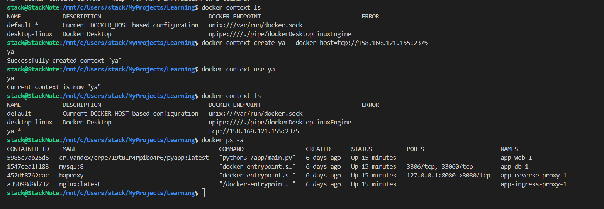

[Скрипт deploy.sh](./app/deploy.sh)

[Исправленный main.py](https://github.com/StackAls/nl-shvirtd-example-python/blob/main/main.py)

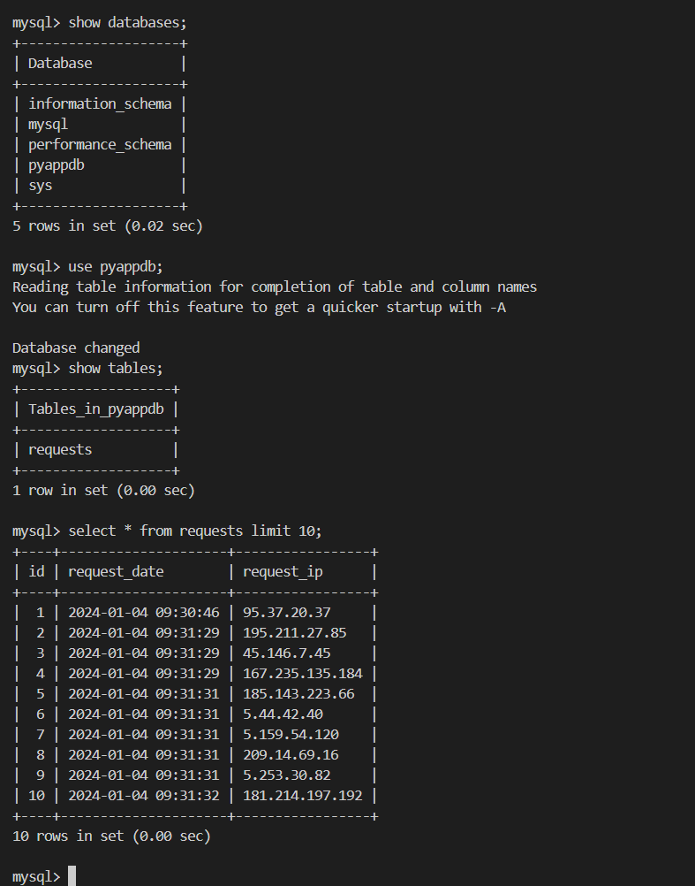
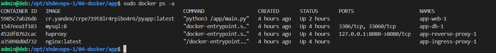

## Задача 5 (*)

На самом деле проще использовать следущий сценарий

```bash
#!/bin/bash
source /opt/shdevops-1/04-docker/app/.env
now=$(date +"%s_%Y-%m-%d")
docker exec -i app-db-1 mysqldump -u root -p"${MYSQL_ROOT_PASSWORD}" ${DB_NAME} > /opt/backup/${now}-dumps.sql
```

При использовании ``schnitzler/mysqldump`` выдаётся ошибка

```bash
mysqldump: Got error: 1045: "Plugin caching_sha2_password could not be loaded: Error loading shared library /usr/lib/mariadb/plugin/caching_sha2_password.so: No such file or directory" when trying to connect
```

Лечится изменением типа аутентификации пользователя.

```bash
ALTER USER 'root' IDENTIFIED WITH mysql_native_password BY 'password';
```

Тогда работает и сценарий с ``schnitzler/mysqldump``

[backup-db.sh](./app/backup-db.sh)

```bash
sudo crontab -e

* * * * * /opt/shdevops-1/04-docker/app/backup-db.sh
```

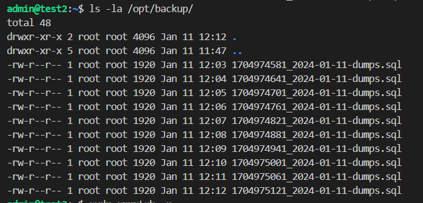

Всё же использование ``schnitzler/mysqldump`` удобно только в compose совместно с другими сервисами - не нужно делать cron задачи на хосте.

## Задача 6

```bash
# Установка dive
export DIVE_VERSION=$(curl -sL "https://api.github.com/repos/wagoodman/dive/releases/latest" | grep '"tag_name":' | sed -E 's/.*"v([^"]+)".*/\1/')
curl -OL https://github.com/wagoodman/dive/releases/download/v${DIVE_VERSION}/dive_${DIVE_VERSION}_linux_amd64.deb
sudo apt install ./dive_${DIVE_VERSION}_linux_amd64.deb

# Скачиваем terraform
docker pull hashicorp/terraform:latest
# Ищем ID слоя с terraform (см. скрин)
dive hashicorp/terraform
# сохраняем имадж в tar
docker save hashicorp/terraform -o terraform.tar
# распаковка и сохранение terraform
mkdir terraform
tar -xf terraform.tar -C terraform/
tar -xf terraform/7613a2e605147d80614fe79f7f2f3c1b5bf66d2d8ef82cf51a566597d0acc6c7/layer.tar -C terraform/
cp terraform/bin/terraform ~/.local/bin/
```

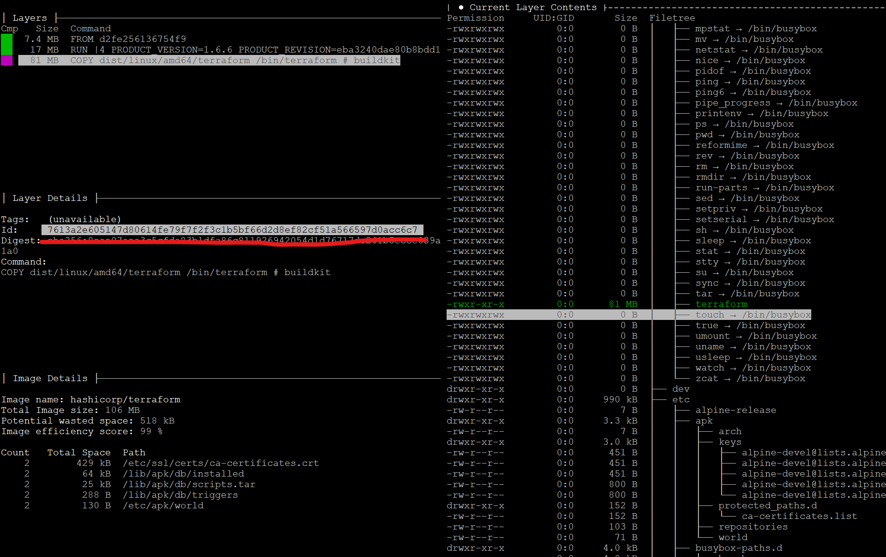

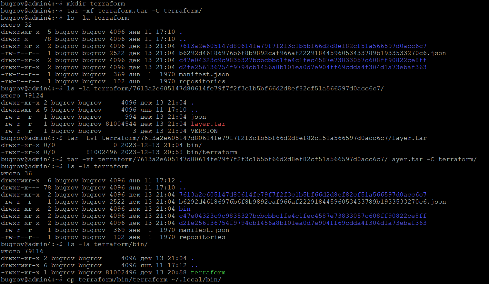

## Задача 6.1 (*)

```bash
docker run -ti --rm --name terraform --entrypoint "/bin/sh" hashicorp/terraform:latest
/ #

# в другом терминале
docker cp terraform:/bin/terraform ~/terraform
Successfully copied 81MB to /home/bugrov/terraform
```
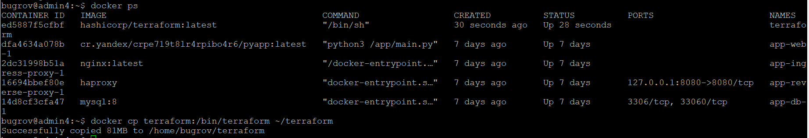

Ну или в одну строчку

```bash
docker run --rm --name terraform --entrypoint "/bin/sh" -v $PWD/terraform:/app hashicorp/terraform:latest -c "cp /bin/terraform /app"
```

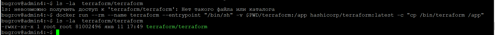

## Задача 6.2 (**)

[Dockerfile](Dockerfile.terraform)

```bash
docker build -f shdevops-1/04-docker/Dockerfile.terraform --output type=local,dest=out .

out/terraform -v

Terraform v1.6.6
on linux_amd64
```

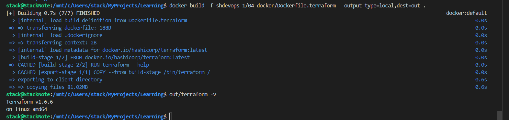
